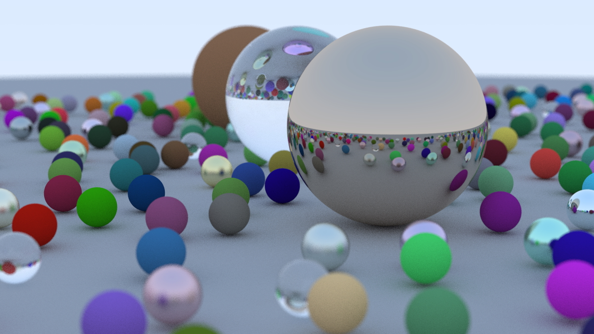
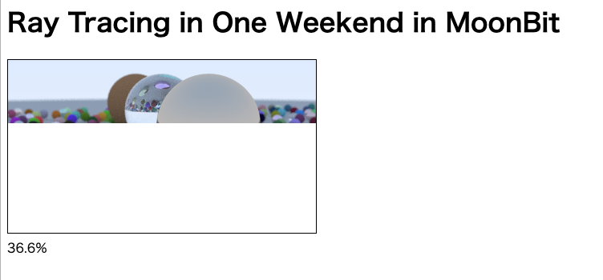

# Ray Tracing in One Weekend - MoonBit実装

[Ray Tracing in One Weekend](https://raytracing.github.io/)のチュートリアルを[MoonBit](https://www.moonbitlang.com/)プログラミング言語で実装したものです。

## 環境

- [MoonBit](https://www.moonbitlang.com/) 0.1.20250801

## 使用方法

### nativeターゲット（ローカル実行）

```bash
moon run --target native > image.ppm
```

### wasm-gcターゲット（ブラウザ描画）

```bash
moon build --target wasm-gc
python -m http.server 8000
```

ブラウザで http://localhost:8000 にアクセスしてindex.htmlを開くと、ブラウザ上でレンダリング結果を確認できます。

## 出力例




## ライセンス

Apache License 2.0

## 作者

Masato Sogame (pocketo7878@gmail.com)
